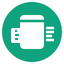

# hello_llm_translate

Example to translate with Large Language Models 

## Setup an Account at https://huggingface.co
* Get and Access Token, so the script can download all the models databases

## Setup the Environment 
```
poetry install
```
## Login to huggingface
```
poetry run hf auth login
```

## Example from English to German
```
cd Helsinki-NLP/opus-mt-en-de/
./main.py 
```

## Local LLM server (Ollama + qwen3:8b)
Run a CPU-only LLM API server on localhost:11434, usable directly by opencode
in this repo (see `opencode.json`).
```
./ask.sh        # menu: start/stop server, install, pull model, test chat
```

### `ask.sh` menu
```
  1  Start Ollama server      start serve on 127.0.0.1:11434
  2  Status                   show server + installed models
  3  Stop server
  4  Pull model qwen3:8b      ~5 GB, one-time
  5  Test chat                send a test request (needs >=256 max_tokens)
  6  Install Ollama           only needed if the ollama binary is missing
  0  Exit
```

On a new machine:
1. `./ask.sh`
2. Pick **6** to install Ollama (a missing binary shows a warning at the menu top; requires `curl`, needs `zstd` on Debian/Ubuntu)
3. Pick **4** to pull `qwen3:8b`
4. Pick **1** to start the server

Runtime files: PID/`.log` → `./.ollama.pid`, `./.ollama.log` (gitignored).
Set `OLLAMA_HOST` (default `127.0.0.1:11434`) or `OLLAMA_BIN` to override.


## Extra Repository ##
```
 git remote add codeberg ssh://git@codeberg.org/veto/hello_llm_translate
 git push codeberg

```


